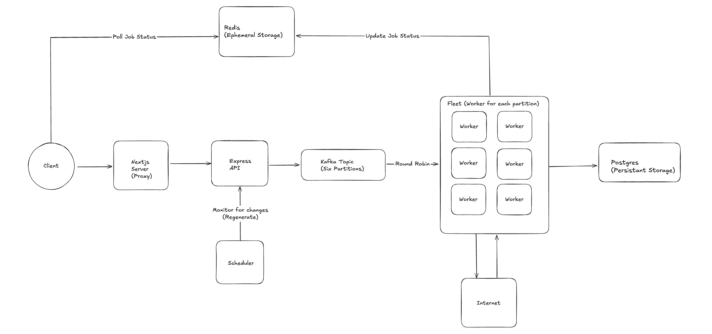
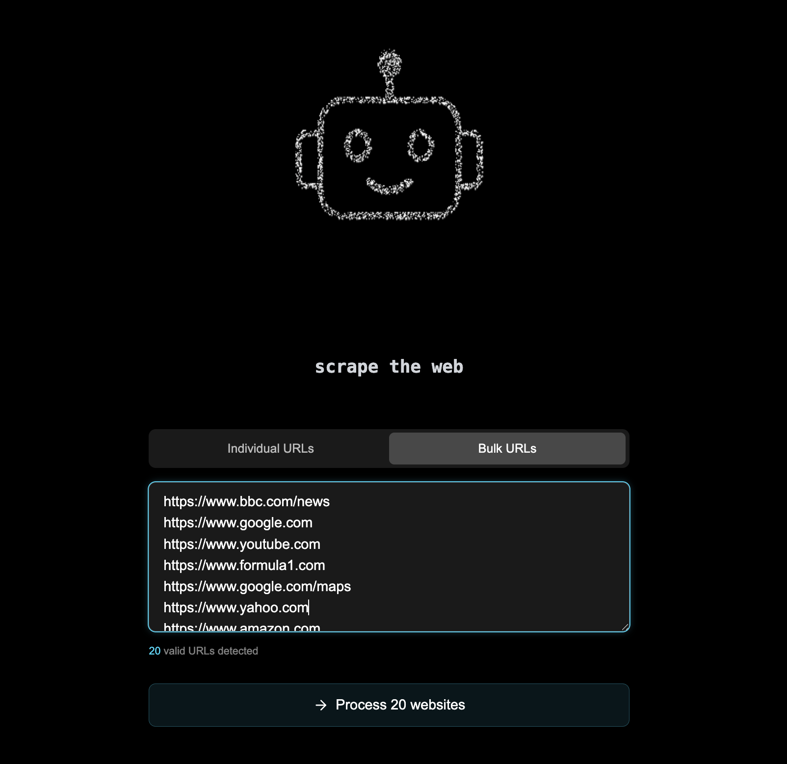
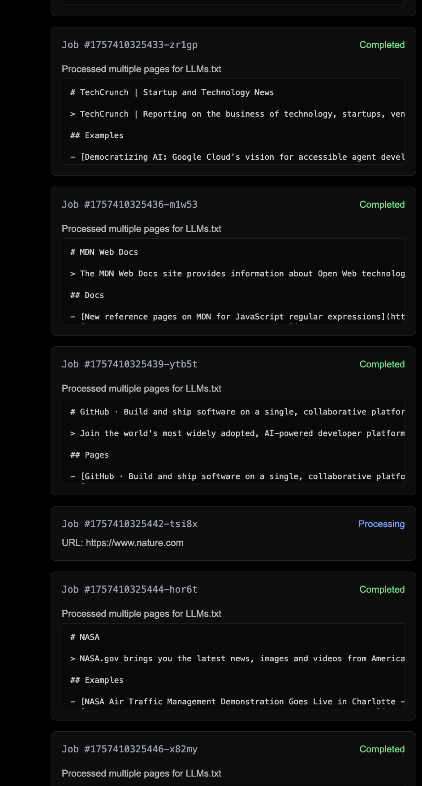

# LLMs Generator

Things that could be improved:

- idempotency
- one request on the frontend that contains all the urls and creates individual messages for each
- add better validation of the urls
- the llm mode was working but refactoring broke it (can use the bulk completion endpoint for this)
- create a better data model

## Architecture

The system consists of several microservices:

- **API**: Express.js API that receives generation requests and enqueues jobs to Kafka
- **Worker**: Processes jobs from Kafka, crawls websites, and generates LLMs.txt content
- **Frontend**: Next.js application that provides a user interface for submitting generation requests
- **Scheduler**: Lightweight service that triggers periodic updates for jobs
- **Infrastructure**:
  - **Kafka**: Message queue for job distribution
  - **Redis**: Caching layer for job status and content
  - **PostgreSQL**: Persistent storage for entries, job history, and content hashes



## Frontend





## Prerequisites

- Docker and Docker Compose
- Node.js 20+ (for local development)

## Setup

1. Clone the repository:

   ```bash
   git clone <repository-url>
   cd llms-txt-web-crawler
   ```

2. Install dependencies (workspaces):

   ```bash
   npm install
   ```

3. Start the services:

   ```bash
   docker compose build --no-cache
   docker compose up -d
   ```

4. The services will be available at:
   - API: http://localhost:3000
   - Frontend: http://localhost:3001
   - Worker Webhook: http://localhost:3002-3007

## System Capabilities

The system can:

- Parse sitemaps to discover website structure
- Fallback to crawling when sitemaps aren't available
- Extract page titles and descriptions for better context
- Handle bulk URL processing efficiently
- Cache generated content for faster retrieval
- Track content changes with hash-based comparisons
- Provide webhooks for change detection and processing
- Optionally enhance content with AI (via OpenAI integration)

## API Endpoints

### Generate LLMs.txt for a single URL

```http
POST /generate
Content-Type: application/json

{
  "url": "https://example.com",
  "options": {
    "includePath": ["path/to/include/*"],
    "excludePath": ["path/to/exclude/*"],
    "force": false
  }
}
```

### Generate LLMs.txt for multiple URLs in bulk

```http
POST /generate/bulk
Content-Type: application/json

{
  "urls": [
    "https://example1.com",
    "https://example2.com"
  ],
  "options": {
    "includePath": ["path/to/include/*"],
    "excludePath": ["path/to/exclude/*"]
  }
}
```

### Check job status

```http
GET /generate/status/:jobId
```

### Download generated content

```http
GET /download/:id
```

## Worker Webhook Endpoints

### Check for content changes

```http
POST /webhook/check-changes
Content-Type: application/json

{
  "url": "https://example.com"
}
```

### Get pending changes

```http
GET /webhook/pending-changes
```

### Mark changes as processed

```http
POST /webhook/mark-processed
Content-Type: application/json

{
  "urls": ["https://example1.com", "https://example2.com"]
}
```

## Configuration

The system is highly configurable through environment variables:

- `JOB_CONCURRENCY`: Number of jobs to process concurrently (default: 60)
- `REQUEST_CONCURRENCY`: Number of HTTP requests per job (default: 10)
- `MAX_URLS`: Maximum number of URLs to process per site (default: 100)
- `MAX_DEPTH`: Maximum crawling depth (default: 4)
- `ENABLE_CHATGPT_ENHANCEMENT`: Whether to enhance content with OpenAI (default: false) [broken atm]
- `OPENAI_API_KEY`: API key for OpenAI integration
- `KAFKA_CONSUMER_MAX_WAIT_TIME_MS`: Maximum wait time for Kafka consumer (default: 100)
- `KAFKA_CONSUMER_MAX_BYTES`: Maximum bytes for Kafka consumer (default: 5242880)

## Docker Deployment

The system is deployed using Docker Compose, which creates:

- 6 worker instances for parallel processing (one for each Kafka partition)
- Fully configured Kafka, Redis, and PostgreSQL instances
- Single instances of the API, Frontend, and Scheduler services

```bash
docker compose up -d --build
```

## Development

For local development:

```bash
# Run the API service in development mode
npm run dev:api

# Run the worker in development mode
npm run dev:worker

# Run both API and worker in development mode
npm run dev
```

## Database Schema

The system uses PostgreSQL for persistent storage with the following tables:

- `jobs`: Tracks job status and metadata
- `llms_entries`: Stores generated LLMs.txt content
- `content_hashes`: Tracks content changes via hash comparison
- `templates`: Stores templates for content generation

## Troubleshooting

If jobs are stuck in pending status:

1. Check that Kafka is running and healthy
2. Verify worker containers are running
3. Check logs for any errors in job processing
4. Ensure Redis connection is working properly
5. Restart containers if there are any issues
